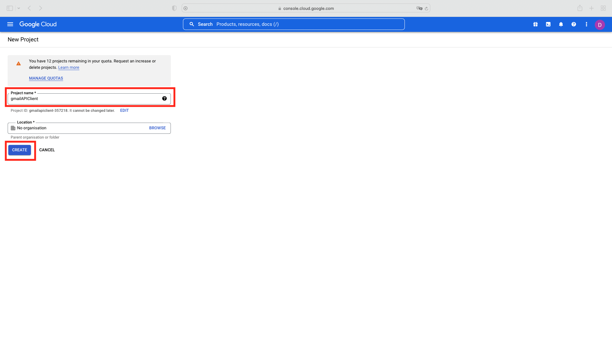
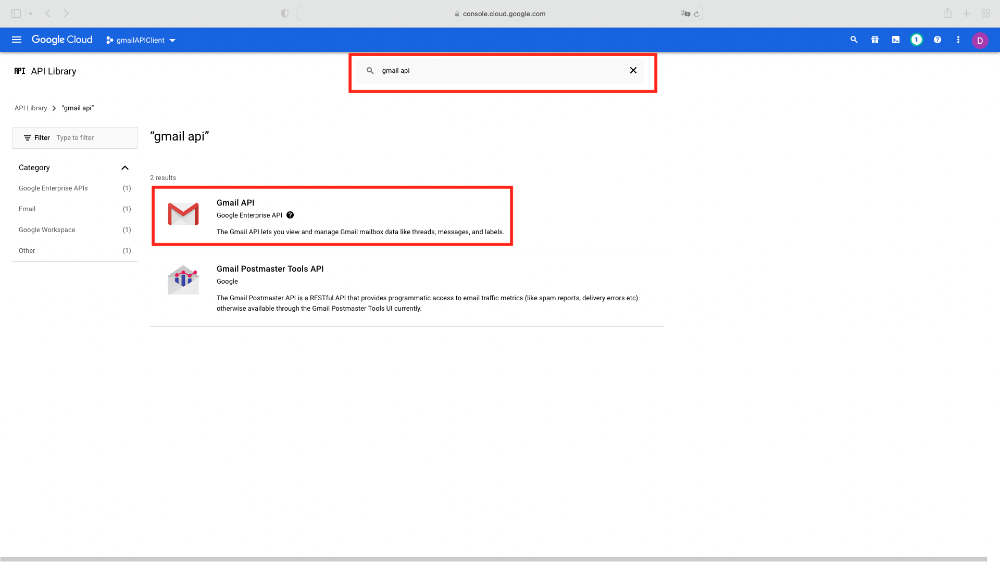
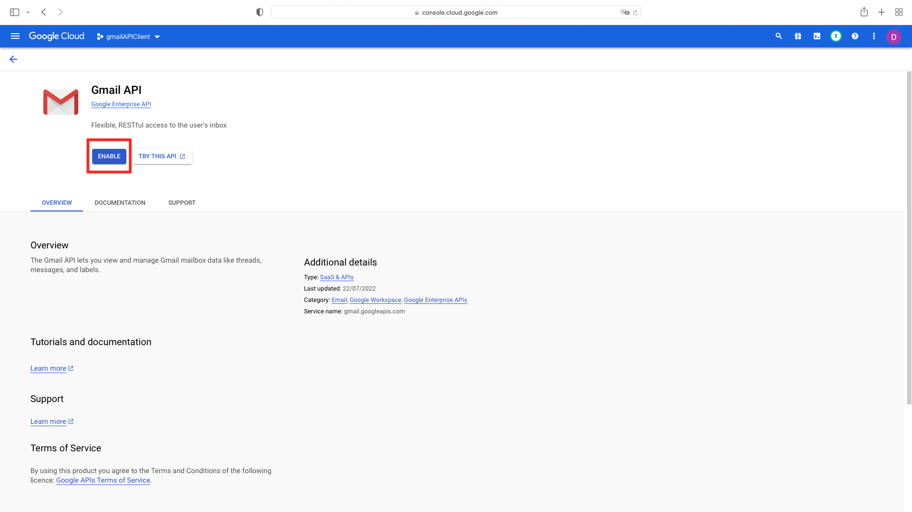
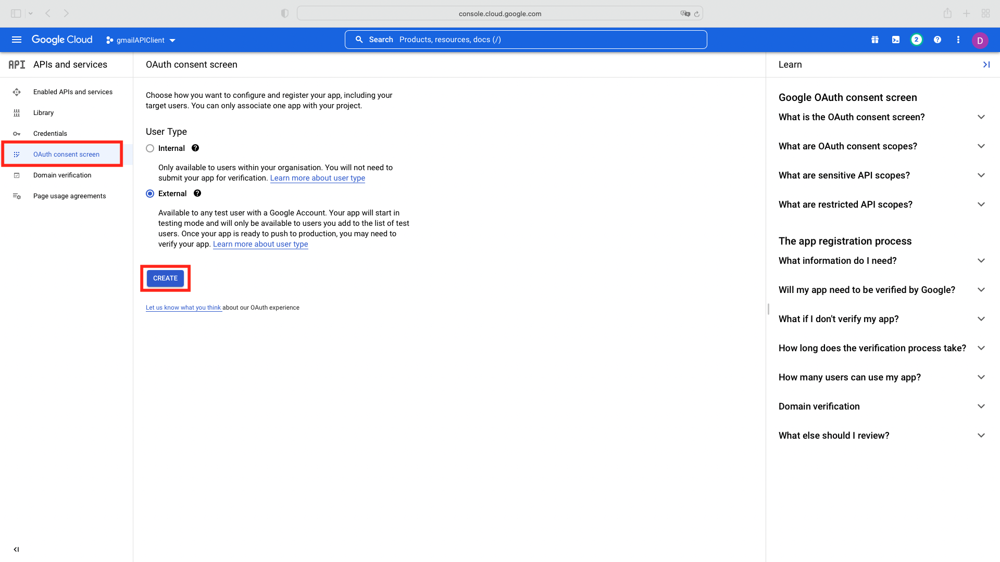
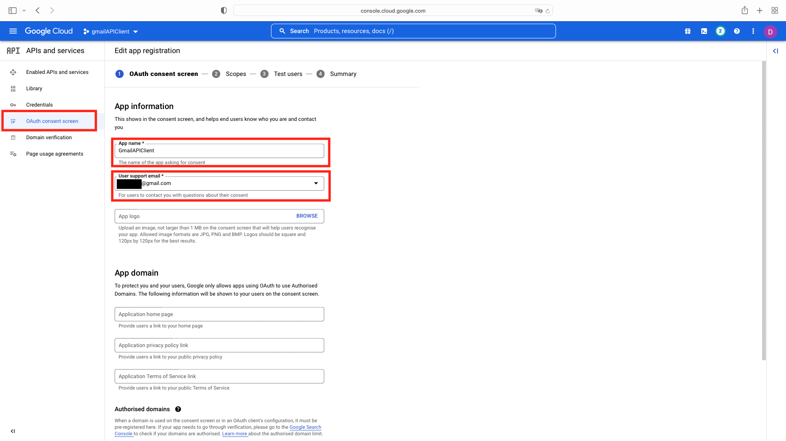
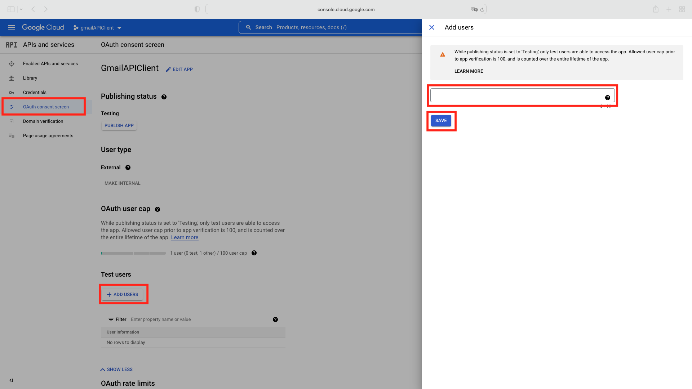
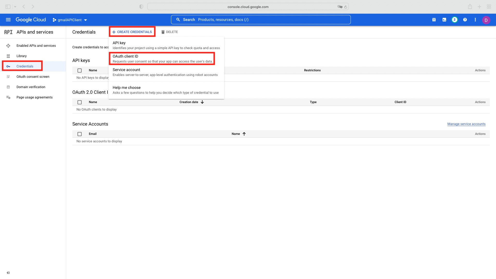
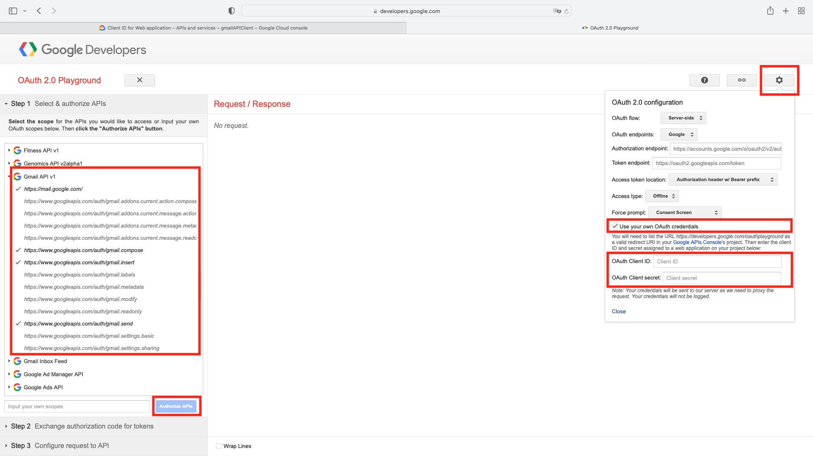

# Creating OAuth Credential and Refresh Token for Gmail Account

Firstly, in order to integrate the Gmail API with your application you need to create an associated project in [Google Cloud console](https://console.cloud.google.com/) in order to enable the Gmail API and that way retrieve a Google Client ID and a Client Secret.

Secondly, let's remember that our goal is to require that the sender account authorizes a single time the use of the Gmail API for its account. We don't want for example to display a prompt to login and authorize use each time an email needs to be sent. For that, we need just a single time that the sender Gmail account's owner log in and authorizes the Gmail API and that way we retrieve a refresh token. With this refresh token we can always make sure we have a valid access token each time we want to send an email without requiring any sender account's owner action. This Gmail API authorization and the refresh token retrievel is done through the [Google Developers OAuth Playground](https://developers.google.com/oauthplayground/).

We know explain how to achieve both things step-by-step.

## Creating a project in Google Cloud Console and enable Gmail API

1. Open [Google Cloud console](https://console.cloud.google.com/) on your browser.
2. Login with some Google account in order to access its features. 
3. Press the "Select a project" button on the top tab and then press the "New Project" button on the pop-up.
4. Fill the form with the name of your project and the name of your organization (if it exists) and then press "Create" button.

5. After creating the project, on the main menu press the "APIs and services" option.
6. Press "Enabled APIs and services" on the left-side menu.
7. Press "Enable APIs and Services" button on the top part of the screen.

8. Search for "Gmail API" and press on the correct option.

9. Press on "Enable" button to enable the Gmail API in your project.

You have created a project in Google Cloud and enabled the Gmail API for that project.

## Create an OAuth Credential for you Application to Access Google APIs

Still on [Google Cloud console](https://console.cloud.google.com/) on your browser.

10. On the left-side menu press "OAuth Consent Screen".
11. You can select "Internal" if you are a part of an organization or "External" if not. Then press "Create" button.

12. Fill the form with your application's information and then press "Save and Continue" (only the first form screen is important). 

13. If on step 2) you have selected "External", on "OAuth Consent screen" press "Add Users" in "Test Users" section. On the pop-up, add the email address from where you want to send emails. 

14. Press "Credentials" on the right-side menu, then press "Create Credentials" and then "OAuth client ID". 

15. On "Create OAuth client ID" form fill the information. Don't forget to add *https://developers.google.com/oauthplayground/* to "Authorised redirect URIs".

On "Create OAUth client ID" by pressing "Create" button, an OAuth Credential is created with an associated **Client ID** and **Client Secret**. Your application is going to need them in order to access Google's APIs.

## Authorize Gmail API with sender gmail account and retrieve associated Refresh Token

16. Open [Google OAuth Playground](2. https://developers.google.com/oauthplayground) on your browser.
17. On the left-side menu slect the "Gmail API" and the actions you want to have access to.
18. On the "Settings" icon in the top-right corner select the "Use your own OAuth Credentials" box. Then add the OAuth Client Id and OAuth Client secret you received on step 15). 
19. Press "Authorize APIs" button.

20. You'll be asked to select an Gmail account and to give permission for the selected actions of Gmail APIs. Accept it.

21. After accepting permissions, you'll be returned to Google OAuth Playground screen and an "Authorization code" will appear on the textfield. 

22. Press the "Exchange authorization code for tokens" button.

23. It will generate automatically a refresh and access token. 
 
 

The **Refresh Token** is very important. It will allow the application to ask for a valid access token everytime it needs to send an email. This way the sender account's owner doesn't need to perform any action from now on in order to accept or login to his account. This is done in the background through an API request to retrieve an access token from the refresh token.
The Refresh Token is going to be valid forever unless the account owner removes Google's API permission to access his account.